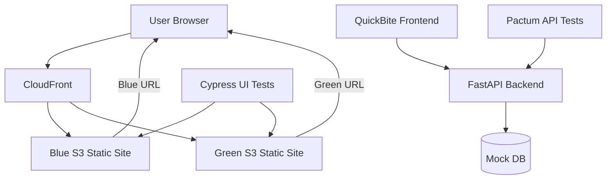

# QuickBite QA - Architecture Overview

This document provides a comprehensive overview of the QuickBite QA system architecture, including the deployment strategy, testing infrastructure, and data flow.

## System Architecture Diagram



## Architecture Explanation

### Blue-Green Deployment Strategy

The QuickBite QA application implements a **blue-green deployment pattern** to achieve zero-downtime deployments and provide instant rollback capabilities.

#### Blue Environment (Production)
- **Purpose**: Current production environment serving live traffic
- **Trigger**: Automated deployment on push to main branch
- **URL**: `quickbite-blue.s3-website-us-east-1.amazonaws.com`
- **Testing**: Comprehensive smoke tests run automatically after deployment

#### Green Environment (Staging)
- **Purpose**: Staging environment for manual testing and validation
- **Trigger**: Manual deployment via GitHub Actions workflow
- **URL**: `quickbite-green.s3-website-us-east-1.amazonaws.com`
- **Promotion**: Manual approval required to promote to production

#### Traffic Management
The architecture supports instant switching between environments:
1. **Normal Operation**: Traffic flows to Blue environment
2. **Deployment Testing**: Green environment deployed with new version
3. **Manual Validation**: Team tests Green environment manually
4. **Traffic Switch**: Manual promotion switches production traffic to Green
5. **Rollback**: Instant fallback to Blue if issues are detected

### Frontend Architecture

#### React Application Structure
```
frontend/
├── src/
│   ├── components/       # Reusable UI components
│   ├── pages/           # Route-specific page components
│   ├── services/        # API integration layer
│   ├── utils/           # Helper functions and utilities
│   └── App.js           # Main application component
├── public/              # Static assets
└── package.json         # Dependencies and scripts
```

#### Key Technologies
- **React 18**: Modern component-based UI framework
- **Material-UI (MUI)**: Professional design system and components
- **React Router**: Client-side routing for single-page application
- **Axios**: HTTP client for API communication
- **Vite**: Fast development server and build tool

#### State Management
- **Local State**: React hooks for component-specific state
- **Global State**: React Context for authentication and cart data
- **Persistence**: localStorage for cart and authentication token storage

### Backend Architecture

#### FastAPI Application Structure
```
fastapi-app/
├── main.py              # Application entry point and routes
├── models/              # Data models and schemas
├── services/            # Business logic layer
├── utils/               # Helper functions
└── requirements.txt     # Python dependencies
```

#### API Endpoints
- **Authentication**: `POST /login` - JWT token generation
- **Menu Management**: `GET /menu` - Restaurant menu items
- **Order Processing**: `POST /order` - Order creation and validation
- **Health Check**: `GET /health` - System status monitoring

#### Data Storage
Currently using **mock data** stored in memory for simplicity:
- Menu items and categories
- User authentication (test credentials)
- Order processing (no persistence)

*Note: Production version would integrate with DynamoDB or RDS for persistent storage*

### Testing Infrastructure

#### UI Testing with Cypress
**Purpose**: End-to-end testing of user interactions and workflows

**Test Coverage**:
- Application loading and navigation
- Authentication flow and token persistence
- Menu browsing and cart functionality
- Complete order placement workflow
- Responsive design across different viewports
- Error handling and graceful degradation

**Execution Environment**:
- Tests run against both Blue and Green environments
- Automated execution in CI/CD pipeline
- Screenshot and video capture for debugging

#### API Testing with Pactum
**Purpose**: Contract-based testing of backend API endpoints

**Test Coverage**:
- Authentication endpoint validation
- Menu data retrieval and structure
- Order processing and validation
- Error scenarios and edge cases
- Response time and performance metrics

**Benefits**:
- Validates API contracts between frontend and backend
- Ensures consistent data structures
- Provides confidence in API reliability

### Deployment Pipeline

#### Continuous Integration
1. **Code Commit**: Developer pushes changes to main branch
2. **Build Process**: GitHub Actions builds React application
3. **Automated Deployment**: Built application deployed to Blue environment
4. **Smoke Testing**: Cypress tests validate critical functionality
5. **Production Update**: DNS updated to point to new Blue deployment

#### Manual Promotion Workflow
1. **Green Deployment**: Manual trigger deploys to Green environment
2. **Manual Testing**: Team validates new features in Green
3. **Approval Gate**: Manual approval required for production promotion
4. **Traffic Switch**: Production traffic switched to Green environment
5. **Monitoring**: Both environments monitored for performance and errors

### Security Considerations

#### Authentication & Authorization
- **JWT Tokens**: Secure authentication with JSON Web Tokens
- **Token Storage**: Secure localStorage implementation
- **Protected Routes**: Route-level authentication enforcement

#### Infrastructure Security
- **CORS Configuration**: Proper cross-origin request handling
- **HTTPS Enforcement**: SSL/TLS encryption for all communications
- **Environment Variables**: Sensitive configuration via GitHub Secrets
- **IAM Roles**: Least-privilege AWS access controls

#### Data Protection
- **Input Validation**: Pydantic models for request validation
- **Sanitization**: XSS and injection attack prevention
- **Error Handling**: Secure error messages without sensitive data exposure

### Performance Optimization

#### Frontend Performance
- **Code Splitting**: Lazy loading for optimal bundle sizes
- **Caching Strategy**: Browser caching for static assets
- **Compression**: Gzip compression for faster loading
- **CDN Integration**: CloudFront for global content delivery

#### Backend Performance
- **Serverless Architecture**: AWS Lambda for automatic scaling
- **Cold Start Optimization**: Minimal dependencies for fast startup
- **Response Caching**: Strategic caching for menu data
- **Connection Pooling**: Optimized database connections (when implemented)

### Monitoring & Observability

#### Application Monitoring
- **Health Checks**: Automated endpoint monitoring
- **Error Tracking**: Comprehensive error logging and alerting
- **Performance Metrics**: Response time and throughput monitoring
- **User Analytics**: Usage patterns and behavior tracking

#### Infrastructure Monitoring
- **AWS CloudWatch**: Infrastructure metrics and logging
- **GitHub Actions**: Deployment pipeline monitoring
- **Test Results**: Automated test execution tracking
- **Artifact Storage**: Test screenshots and videos for debugging

### Scalability Considerations

#### Current Architecture Benefits
- **Serverless Backend**: Automatic scaling with AWS Lambda
- **Static Frontend**: Global CDN distribution with S3
- **Stateless Design**: Horizontal scaling capabilities
- **Microservices Ready**: Modular architecture for service decomposition

#### Future Scaling Options
- **Database Scaling**: DynamoDB for NoSQL scaling or RDS with read replicas
- **Caching Layer**: Redis or ElastiCache for performance optimization
- **Load Balancing**: Application Load Balancer for multi-instance deployments
- **Geographic Distribution**: Multi-region deployment for global users

---

This architecture provides a solid foundation for a production-ready restaurant ordering system while maintaining simplicity for development and testing. The blue-green deployment strategy ensures reliable releases, while comprehensive testing provides confidence in application quality.
